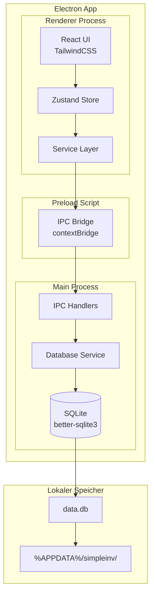
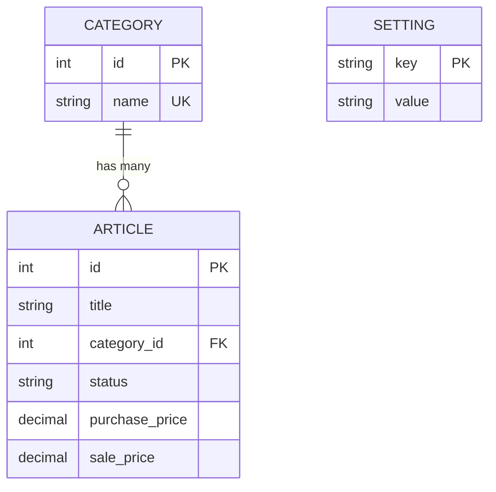

# SimpleInv Fullstack Architecture Document

**Version:** 1.9
**Datum:** 06.12.2025
**Status:** Approved
**Autor:** Winston (Architect)

---

## Inhaltsverzeichnis

1. [Einleitung](#1-einleitung)
2. [High-Level Architektur](#2-high-level-architektur)
3. [Tech Stack](#3-tech-stack)
4. [Datenmodelle](#4-datenmodelle)
5. [API/IPC-Spezifikation](#5-apiipc-spezifikation)
6. [Komponenten-Architektur](#6-komponenten-architektur)
7. [Frontend-Architektur](#7-frontend-architektur)
8. [Backend-Architektur](#8-backend-architektur)
9. [Datenbank-Schema](#9-datenbank-schema)
10. [Projektstruktur](#10-projektstruktur)
11. [Coding-Standards](#11-coding-standards)

---

## 1. Einleitung

Dieses Dokument beschreibt die vollständige Fullstack-Architektur für SimpleInv, eine Offline-First Desktop-Anwendung für Reseller zur Inventarverwaltung.

### 1.1 Starter Template

**Basis:** electron-vite (via Electron Forge mit Vite Plugin)
**Typ:** Greenfield-Projekt mit etabliertem Tooling

### 1.2 Change Log

| Datum | Version | Beschreibung | Autor |
|-------|---------|--------------|-------|
| 06.12.2025 | 1.0 | Initiale Architektur-Erstellung | Winston (Architect) |
| 06.12.2025 | 1.1 | Edge Cases, Performance-Strategie und Fehlerbehandlung hinzugefügt (Abschnitte 2.6-2.8) | Winston (Architect) |
| 06.12.2025 | 1.2 | Technologie-Entscheidungen mit Alternativen, Migrations-Strategie und Backup & Recovery hinzugefügt (Abschnitte 3.1-3.3) | Winston (Architect) |
| 06.12.2025 | 1.3 | UI Base Components, Feature-Komponenten-Spezifikation, Reusability Patterns und Performance-Optimierung hinzugefügt (Abschnitte 6.2-6.6) | Winston (Architect) |
| 06.12.2025 | 1.4 | Resilience & Operational Readiness: Logging-Strategie, Retry-Strategie, CI/CD Pipeline, Deployment-Strategie, Auto-Update (Abschnitt 12) | Winston (Architect) |
| 06.12.2025 | 1.5 | Security: Electron Security Best Practices, IPC Security, Input Validation mit Zod, Datensicherheit (Abschnitt 13) | Winston (Architect) |
| 06.12.2025 | 1.6 | Testing-Strategie (Unit, Integration, E2E) und Development Environment (Setup, Git-Workflow, Debugging) hinzugefügt (Abschnitte 14-15) | Winston (Architect) |
| 06.12.2025 | 1.7 | Dependency Management: Lizenz-Übersicht, Update-Strategie, Native Module Handling (Abschnitt 16) | Winston (Architect) |
| 06.12.2025 | 1.8 | AI Agent Implementation Guide: Pitfalls, Implementierungs-Reihenfolge, Referenzen (Abschnitt 17) | Winston (Architect) |
| 06.12.2025 | 1.9 | Accessibility: Semantisches HTML, ARIA-Richtlinien, Keyboard-Navigation, Focus Management, A11y-Linting (Abschnitt 18) | Winston (Architect) |

---

## 2. High-Level Architektur

### 2.1 Technische Zusammenfassung

SimpleInv ist eine **Offline-First Desktop-Anwendung** für Windows, gebaut als Electron-App mit React-Frontend und SQLite-Datenbank. Die Architektur folgt dem klassischen Electron-Pattern mit strikter Prozess-Trennung: Der **Main Process** verwaltet die Datenbank und System-Ressourcen, während der **Renderer Process** die React-UI ausführt. Die Kommunikation erfolgt über typsichere IPC-Kanäle mit Preload-Scripts für Context Isolation.

### 2.2 Plattform und Infrastruktur

| Aspekt | Wahl | Begründung |
|--------|------|------------|
| Runtime | Electron 39+ | Cross-Platform Desktop Framework |
| Datenbank | SQLite (better-sqlite3) | Synchron, schnell, Offline-First |
| Speicherort | %APPDATA%/simpleinv/ | Windows-Standard |
| Build/Package | Electron Forge + Vite | Offizielles Tooling |

### 2.3 Repository-Struktur

**Struktur:** Single Repository (kein Monorepo-Tool nötig)

### 2.4 High-Level Architektur-Diagramm



### 2.5 Architektur-Pattern

- **Offline-First Architecture:** Alle Daten lokal in SQLite
- **Process Isolation Pattern:** Strikte Trennung Main/Renderer
- **Repository Pattern:** Abstrahierte Datenbankzugriffe
- **Component-Based UI:** React-Komponenten mit TypeScript
- **Centralized State Management:** Zustand für globalen State

### 2.6 Edge Cases & Grenzszenarien

| Szenario | Verhalten | Technische Umsetzung |
|----------|-----------|---------------------|
| Leere Datenbank | Freundliche "Keine Artikel vorhanden" Nachricht, Metriken zeigen €0,00/0 | Conditional Rendering im Frontend |
| Große Datenmengen (1000+ Artikel) | Tabelle bleibt performant durch virtualisiertes Rendering | TanStack Table mit `@tanstack/react-virtual` bei Bedarf |
| Kategorie mit Artikeln löschen | Artikel behalten, category_id wird NULL | `ON DELETE SET NULL` Foreign Key |
| Ungültige Eingaben | Validierung im Frontend vor Speichern | Zod-Schema oder manuelle Validierung |
| Datenbank-Datei fehlt/korrupt | Automatische Neuerstellung beim Start | try-catch im DatabaseService.initialize() |

### 2.7 Performance-Strategie

**Ziel:** App-Start < 3 Sekunden, UI-Reaktionen < 100ms (NFR1)

| Maßnahme | Beschreibung | Komponente |
|----------|--------------|------------|
| SQLite WAL-Modus | Write-Ahead Logging für schnellere Schreiboperationen | DatabaseService |
| Synchrone DB-Operationen | better-sqlite3 ist synchron → kein Promise-Overhead | Main Process |
| Lazy Loading | Komponenten nur bei Bedarf laden | React.lazy() |
| Vite Code Splitting | Automatisches Chunking für schnelleren Initial Load | Build Config |
| Indexed Queries | Indizes auf `status` und `category_id` für schnelle Filterung | DB Schema |
| Minimale Dependencies | Nur essentielle Libraries, kein Redux/MobX Overhead | package.json |

**Messbare Ziele:**

| Metrik | Zielwert |
|--------|----------|
| Cold Start (erste Öffnung) | < 3s |
| Warm Start (App bereits geladen) | < 1s |
| Artikel laden (100 Artikel) | < 50ms |
| Artikel speichern | < 20ms |

### 2.8 Fehlerbehandlungsstrategie

#### Frontend (Renderer Process)

```typescript
// src/renderer/utils/errorHandling.ts

// Alle IPC-Aufrufe werden in try-catch gewrappt
try {
  const articles = await window.api.articles.getAll();
  set({ articles, isLoading: false });
} catch (error) {
  set({ error: parseError(error), isLoading: false });
  // Toast-Notification an User
}
```

#### Backend (Main Process)

```typescript
// src/main/ipc/handlers/baseHandler.ts

// IPC Handler Pattern
ipcMain.handle('articles:create', async (_, input: ArticleInput) => {
  try {
    return articleRepository.create(input);
  } catch (error) {
    // Strukturierter Fehler zurück an Renderer
    throw new IpcError('ARTICLE_CREATE_FAILED', error.message);
  }
});
```

#### Fehlertypen

| Typ | Beispiel | User-Feedback |
|-----|----------|---------------|
| Validierungsfehler | Titel leer, Preis negativ | Inline-Fehlermeldung im Formular |
| Datenbankfehler | SQLite UNIQUE Constraint | Toast: "Kategorie existiert bereits" |
| Systemfehler | Datenbank nicht erreichbar | Modal: "Datenbank konnte nicht geladen werden" |

#### Graceful Degradation

- Bei DB-Fehler: App zeigt Fehlermeldung, blockiert aber nicht komplett
- Bei Theme-Ladefehler: Fallback auf Light Mode
- Bei korrupter Einstellung: Zurücksetzen auf Default-Wert

---

## 3. Tech Stack

| Kategorie | Technologie | Version | Zweck |
|-----------|-------------|---------|-------|
| Runtime | Electron | 39.x | Desktop-App-Container |
| Frontend-Sprache | TypeScript | 5.9.x | Typsicherheit |
| Frontend-Framework | React | 19.x | UI-Komponenten |
| Build Tool | Electron Forge + Vite | 7.5+ | Build & HMR |
| CSS Framework | TailwindCSS | 4.1.x | Styling |
| State Management | Zustand | 5.x | Globaler State |
| Tabellen-Komponente | TanStack Table | 8.21.x | Sortierbare Tabelle |
| Color Picker | react-colorful | 5.x | Custom Theme |
| Datenbank | SQLite (better-sqlite3) | 11.x | Lokale Persistenz |
| Packaging | electron-builder | 25.x | Windows Installer |
| Linting | ESLint | 9.x | Code-Qualität |
| Formatting | Prettier | 3.x | Code-Formatierung |

### 3.1 Technologie-Entscheidungen

#### State Management: Zustand

| Kriterium | Zustand | Redux | Jotai | Entscheidung |
|-----------|---------|-------|-------|--------------|
| Bundle Size | ~1KB | ~7KB | ~2KB | ✅ Zustand |
| Boilerplate | Minimal | Hoch (Actions, Reducers) | Minimal | ✅ Zustand |
| Lernkurve | Flach | Steil | Flach | ✅ Zustand |
| DevTools | Ja | Ja (besser) | Ja | Neutral |
| TypeScript | Exzellent | Gut | Exzellent | Neutral |

**Begründung:** Für eine kleine Desktop-App mit 3-4 Stores ist Zustand ideal. Redux wäre Overkill, Jotai ist atomarer als nötig.

#### Tabellen-Komponente: TanStack Table

| Kriterium | TanStack Table | AG-Grid | React-Table v7 | Entscheidung |
|-----------|----------------|---------|----------------|--------------|
| Lizenz | MIT (kostenlos) | Community/Enterprise | MIT | ✅ TanStack |
| Bundle Size | ~15KB | ~200KB+ | Deprecated | ✅ TanStack |
| Sortierung | Built-in | Built-in | Built-in | Neutral |
| Virtualisierung | Plugin | Built-in | Nein | Neutral |
| Headless | Ja | Nein (eigenes Styling) | Ja | ✅ TanStack |

**Begründung:** TanStack Table ist der Nachfolger von React-Table, headless (passt zu TailwindCSS), und für unsere Anforderungen (Sortierung, <1000 Zeilen) perfekt dimensioniert.

#### Datenbank: SQLite (better-sqlite3)

| Kriterium | better-sqlite3 | sql.js | LokiJS | Entscheidung |
|-----------|----------------|--------|--------|--------------|
| Performance | Nativ, schnell | WASM, langsamer | In-Memory | ✅ better-sqlite3 |
| Synchron | Ja | Nein | Ja | ✅ better-sqlite3 |
| Persistenz | Native File | Manual Save | Manual Save | ✅ better-sqlite3 |
| Electron-Kompatibilität | Exzellent | Gut | Gut | ✅ better-sqlite3 |

**Begründung:** better-sqlite3 ist synchron (kein Callback-Hell), nativ kompiliert (schnell), und der De-facto-Standard für Electron + SQLite.

#### CSS Framework: TailwindCSS

| Kriterium | TailwindCSS | CSS Modules | Styled-Components | Entscheidung |
|-----------|-------------|-------------|-------------------|--------------|
| Dark Mode | Built-in (`dark:`) | Manual | Manual | ✅ Tailwind |
| Bundle Size | Purged ~10KB | Minimal | ~15KB Runtime | ✅ Tailwind |
| Entwicklungsgeschwindigkeit | Sehr hoch | Mittel | Mittel | ✅ Tailwind |
| Konsistenz | Design System | Manual | Manual | ✅ Tailwind |

**Begründung:** TailwindCSS bietet eingebautes Dark Mode Handling, schnelle Entwicklung durch Utility Classes, und automatisches Purging für kleine Bundle-Größen.

### 3.2 Migrations-Strategie

**Aktueller Stand (MVP):** Schema wird einmalig bei App-Start erstellt, keine Migrationen.

**Post-MVP Strategie:**

```typescript
// src/main/database/migrations/index.ts

interface Migration {
  version: number;
  up: (db: Database) => void;
  description: string;
}

const migrations: Migration[] = [
  {
    version: 1,
    description: 'Initial schema',
    up: (db) => { /* Initial tables */ }
  },
  {
    version: 2,
    description: 'Add notes field to articles',
    up: (db) => {
      db.exec('ALTER TABLE articles ADD COLUMN notes TEXT');
    }
  }
];

export function runMigrations(db: Database): void {
  const currentVersion = db.pragma('user_version', { simple: true }) as number;

  for (const migration of migrations) {
    if (migration.version > currentVersion) {
      migration.up(db);
      db.pragma(`user_version = ${migration.version}`);
    }
  }
}
```

**Versionierung:**
- SQLite `user_version` PRAGMA speichert aktuelle Schema-Version
- Migrationen sind vorwärts-only (kein Rollback für Einfachheit)
- Backup vor Migration empfohlen

### 3.3 Backup & Recovery

#### Backup-Strategie

| Methode | Beschreibung | Wann |
|---------|--------------|------|
| **Manuell** | User kopiert `%APPDATA%/simpleinv/data.db` | Jederzeit |
| **Export (Post-MVP)** | "Daten exportieren" Button in Einstellungen | User-initiiert |
| **Auto-Backup (Post-MVP)** | Kopie vor Migrationen erstellen | Automatisch |

#### Backup-Speicherort

```
%APPDATA%/simpleinv/
├── data.db              # Aktuelle Datenbank
├── backups/             # (Post-MVP)
│   ├── data_2025-12-06_pre-migration.db
│   └── data_2025-12-05_manual.db
```

#### Recovery-Prozess

1. **App schließen**
2. **Backup-Datei nach `data.db` kopieren** (Original überschreiben)
3. **App starten** - Daten sind wiederhergestellt

#### Datenintegrität

```typescript
// src/main/database/index.ts

// WAL-Modus für Crash-Resistenz
this.db.pragma('journal_mode = WAL');

// Foreign Keys für referentielle Integrität
this.db.pragma('foreign_keys = ON');

// Integrity Check bei Bedarf
const result = this.db.pragma('integrity_check');
if (result[0].integrity_check !== 'ok') {
  // Warnung an User, Backup empfehlen
}
```

---

## 4. Datenmodelle

### 4.1 Article (Artikel)

```typescript
// src/shared/types/article.ts

export type ArticleStatus = 'in_stock' | 'listed' | 'sold' | 'returned';

export interface Article {
  id: number;
  title: string;
  categoryId: number | null;
  status: ArticleStatus;
  purchasePlatform: string | null;
  purchasePrice: number;
  purchaseDate: string | null;
  shippingCostIn: number;
  salePlatform: string | null;
  salePrice: number | null;
  saleDate: string | null;
  fees: number;
  shippingCostOut: number;
  createdAt: string;
  updatedAt: string;
}

export interface ArticleInput {
  title: string;
  categoryId: number | null;
  status: ArticleStatus;
  purchasePlatform?: string;
  purchasePrice: number;
  purchaseDate?: string;
  shippingCostIn?: number;
  salePlatform?: string;
  salePrice?: number;
  saleDate?: string;
  fees?: number;
  shippingCostOut?: number;
}

export interface ArticleWithCalculations extends Article {
  profit: number | null;
  roi: number | null;
}
```

### 4.2 Category (Kategorie)

```typescript
// src/shared/types/category.ts

export interface Category {
  id: number;
  name: string;
}

export interface CategoryInput {
  name: string;
}
```

### 4.3 Setting (Einstellung)

```typescript
// src/shared/types/settings.ts

export type ThemeMode = 'light' | 'dark' | 'custom';

export interface ThemeSettings {
  mode: ThemeMode;
  customColor?: string;
}

export interface AppSettings {
  theme: ThemeSettings;
}

export const SETTING_KEYS = {
  THEME: 'theme',
} as const;
```

### 4.4 Berechnungs-Utilities

```typescript
// src/shared/utils/calculations.ts

export function calculateProfit(article: Article): number | null {
  if (article.salePrice === null) return null;
  return (
    article.salePrice -
    article.purchasePrice -
    article.fees -
    article.shippingCostIn -
    article.shippingCostOut
  );
}

export function calculateRoi(article: Article): number | null {
  const profit = calculateProfit(article);
  if (profit === null || article.purchasePrice === 0) return null;
  return Math.round((profit / article.purchasePrice) * 10000) / 100;
}

export function withCalculations(article: Article): ArticleWithCalculations {
  return {
    ...article,
    profit: calculateProfit(article),
    roi: calculateRoi(article),
  };
}
```

### 4.5 Entity-Relationship Diagramm



---

## 5. API/IPC-Spezifikation

### 5.1 IPC Channel Definitionen

```typescript
// src/shared/ipc/channels.ts

export const IPC_CHANNELS = {
  ARTICLES: {
    GET_ALL: 'articles:getAll',
    GET_BY_ID: 'articles:getById',
    CREATE: 'articles:create',
    UPDATE: 'articles:update',
    DELETE: 'articles:delete',
  },
  CATEGORIES: {
    GET_ALL: 'categories:getAll',
    CREATE: 'categories:create',
    UPDATE: 'categories:update',
    DELETE: 'categories:delete',
  },
  SETTINGS: {
    GET: 'settings:get',
    SET: 'settings:set',
  },
  METRICS: {
    GET_DASHBOARD: 'metrics:getDashboard',
  },
} as const;
```

### 5.2 API Type Definitionen

```typescript
// src/shared/ipc/types.ts

export interface ArticleApi {
  getAll(): Promise<Article[]>;
  getById(id: number): Promise<Article | null>;
  create(input: ArticleInput): Promise<Article>;
  update(id: number, input: Partial<ArticleInput>): Promise<Article>;
  delete(id: number): Promise<void>;
}

export interface CategoryApi {
  getAll(): Promise<Category[]>;
  create(input: CategoryInput): Promise<Category>;
  update(id: number, input: CategoryInput): Promise<Category>;
  delete(id: number): Promise<void>;
}

export interface SettingsApi {
  get<K extends keyof AppSettings>(key: K): Promise<AppSettings[K] | null>;
  set<K extends keyof AppSettings>(key: K, value: AppSettings[K]): Promise<void>;
}

export interface DashboardMetrics {
  totalProfit: number;
  openInventoryValue: number;
  unsoldCount: number;
}

export interface MetricsApi {
  getDashboard(): Promise<DashboardMetrics>;
}

export interface ElectronApi {
  articles: ArticleApi;
  categories: CategoryApi;
  settings: SettingsApi;
  metrics: MetricsApi;
}
```

### 5.3 Preload Script

```typescript
// src/preload/index.ts

import { contextBridge, ipcRenderer } from 'electron';
import { IPC_CHANNELS } from '../shared/ipc/channels';
import type { ElectronApi } from '../shared/ipc/types';

const api: ElectronApi = {
  articles: {
    getAll: () => ipcRenderer.invoke(IPC_CHANNELS.ARTICLES.GET_ALL),
    getById: (id) => ipcRenderer.invoke(IPC_CHANNELS.ARTICLES.GET_BY_ID, id),
    create: (input) => ipcRenderer.invoke(IPC_CHANNELS.ARTICLES.CREATE, input),
    update: (id, input) => ipcRenderer.invoke(IPC_CHANNELS.ARTICLES.UPDATE, id, input),
    delete: (id) => ipcRenderer.invoke(IPC_CHANNELS.ARTICLES.DELETE, id),
  },
  categories: {
    getAll: () => ipcRenderer.invoke(IPC_CHANNELS.CATEGORIES.GET_ALL),
    create: (input) => ipcRenderer.invoke(IPC_CHANNELS.CATEGORIES.CREATE, input),
    update: (id, input) => ipcRenderer.invoke(IPC_CHANNELS.CATEGORIES.UPDATE, id, input),
    delete: (id) => ipcRenderer.invoke(IPC_CHANNELS.CATEGORIES.DELETE, id),
  },
  settings: {
    get: (key) => ipcRenderer.invoke(IPC_CHANNELS.SETTINGS.GET, key),
    set: (key, value) => ipcRenderer.invoke(IPC_CHANNELS.SETTINGS.SET, key, value),
  },
  metrics: {
    getDashboard: () => ipcRenderer.invoke(IPC_CHANNELS.METRICS.GET_DASHBOARD),
  },
};

contextBridge.exposeInMainWorld('api', api);
```

---

## 6. Komponenten-Architektur

### 6.1 Frontend-Komponenten Übersicht

| Komponente | Verantwortung |
|------------|---------------|
| Dashboard Page | Hauptansicht mit Metriken und Tabelle |
| Metrics Cards | 3 Dashboard-Metriken |
| Article Table | Sortierbare Artikel-Tabelle |
| Article Modal | Detail-Ansicht und Bearbeiten |
| Article Form | Formular für CRUD |
| Category Manager | Kategorien verwalten |
| Settings Modal | Theme-Einstellungen |

### 6.2 UI Base Components (components/ui/)

Wiederverwendbare, generische UI-Komponenten:

#### Button

```typescript
// src/renderer/components/ui/Button.tsx

interface ButtonProps {
  children: React.ReactNode;
  variant?: 'primary' | 'secondary' | 'danger' | 'ghost';
  size?: 'sm' | 'md' | 'lg';
  disabled?: boolean;
  loading?: boolean;
  onClick?: () => void;
  type?: 'button' | 'submit';
}

// Verwendung: <Button variant="primary" onClick={handleSave}>Speichern</Button>
```

#### Modal

```typescript
// src/renderer/components/ui/Modal.tsx

interface ModalProps {
  isOpen: boolean;
  onClose: () => void;
  title: string;
  children: React.ReactNode;
  size?: 'sm' | 'md' | 'lg';
  showCloseButton?: boolean;
}

// Verwendung: <Modal isOpen={isOpen} onClose={close} title="Artikel Details">...</Modal>
```

#### Input / Select / Form Controls

```typescript
// src/renderer/components/ui/Input.tsx

interface InputProps {
  label: string;
  value: string | number;
  onChange: (value: string) => void;
  type?: 'text' | 'number' | 'date';
  placeholder?: string;
  error?: string;
  required?: boolean;
  disabled?: boolean;
}

// src/renderer/components/ui/Select.tsx

interface SelectProps<T> {
  label: string;
  value: T;
  onChange: (value: T) => void;
  options: { value: T; label: string }[];
  placeholder?: string;
  error?: string;
  required?: boolean;
}
```

#### Card

```typescript
// src/renderer/components/ui/Card.tsx

interface CardProps {
  children: React.ReactNode;
  title?: string;
  className?: string;
  padding?: 'none' | 'sm' | 'md' | 'lg';
}

// Verwendung für Metriken: <Card title="Gesamtprofit"><MetricValue value={profit} /></Card>
```

#### Toast / Notification

```typescript
// src/renderer/components/ui/Toast.tsx

interface ToastProps {
  message: string;
  type: 'success' | 'error' | 'info' | 'warning';
  duration?: number; // ms, default 3000
  onClose: () => void;
}

// Globaler Toast-State im UI-Store
```

#### StatusBadge

```typescript
// src/renderer/components/ui/StatusBadge.tsx

interface StatusBadgeProps {
  status: ArticleStatus;
}

// Farben: in_stock=blue, listed=orange, sold=green, returned=red
```

### 6.3 Feature-Komponenten Spezifikation

#### Dashboard Page

```typescript
// src/renderer/components/dashboard/DashboardPage.tsx

// Props: keine (verwendet Stores direkt)
// State: lädt Daten beim Mount via useEffect

// Struktur:
// ├── Header (App-Titel, Settings-Button)
// ├── MetricsRow
// │   ├── MetricCard (Gesamtprofit)
// │   ├── MetricCard (Offener Warenwert)
// │   └── MetricCard (Nicht verkaufte Artikel)
// ├── ActionBar (+ Artikel hinzufügen, Kategorien verwalten)
// └── ArticleTable
```

#### ArticleTable

```typescript
// src/renderer/components/articles/ArticleTable.tsx

interface ArticleTableProps {
  articles: ArticleWithCalculations[];
  onRowClick: (article: Article) => void;
  isLoading?: boolean;
}

// Spalten: Titel, Kategorie, Status, Kaufpreis, Verkaufspreis, Profit
// Features: Sortierung (TanStack Table), Status-Badge, Profit-Formatierung
// Empty State: "Keine Artikel vorhanden. Fügen Sie Ihren ersten Artikel hinzu."
```

#### ArticleModal (Detail-Ansicht)

```typescript
// src/renderer/components/articles/ArticleModal.tsx

interface ArticleModalProps {
  article: ArticleWithCalculations | null;
  isOpen: boolean;
  onClose: () => void;
  onEdit: () => void;
  onDelete: () => void;
}

// Zeigt alle Artikel-Details gruppiert:
// - Basis-Info (Titel, Kategorie, Status)
// - Einkauf (Plattform, Preis, Datum, Versand)
// - Verkauf (Plattform, Preis, Datum, Gebühren, Versand)
// - Berechnungen (Profit, ROI)
```

#### ArticleForm

```typescript
// src/renderer/components/articles/ArticleForm.tsx

interface ArticleFormProps {
  article?: Article; // undefined = Create, defined = Edit
  onSubmit: (data: ArticleInput) => Promise<void>;
  onCancel: () => void;
  isSubmitting?: boolean;
}

// Validierung:
// - Titel: required, min 1 char
// - Kaufpreis: required, >= 0
// - Alle anderen Felder: optional

// Gruppen: Basis | Einkauf | Verkauf (visuell getrennt)
```

#### CategoryManager

```typescript
// src/renderer/components/categories/CategoryManager.tsx

interface CategoryManagerProps {
  isOpen: boolean;
  onClose: () => void;
}

// State: categories, newCategoryName, editingId
// Features:
// - Liste aller Kategorien
// - Inline-Add (Input + Button)
// - Inline-Edit (Doppelklick oder Edit-Icon)
// - Delete mit Confirmation Dialog
```

#### SettingsModal

```typescript
// src/renderer/components/settings/SettingsModal.tsx

interface SettingsModalProps {
  isOpen: boolean;
  onClose: () => void;
}

// Sektionen:
// - Theme (Light/Dark/Custom Radio + ColorPicker)
// - Info (Version, DB-Pfad)
// Auto-Save bei Änderungen
```

### 6.4 Component Reusability Patterns

#### Composition Pattern

```typescript
// Komplexe Komponenten aus einfachen zusammensetzen
<Modal isOpen={isOpen} onClose={onClose} title="Artikel bearbeiten">
  <ArticleForm article={article} onSubmit={handleSubmit} onCancel={onClose} />
</Modal>
```

#### Render Props für Flexibilität

```typescript
// Table mit custom Cell Rendering
<ArticleTable
  articles={articles}
  renderStatus={(status) => <StatusBadge status={status} />}
  renderProfit={(profit) => <ProfitDisplay value={profit} />}
/>
```

#### Custom Hooks für Logic Reuse

```typescript
// src/renderer/hooks/useArticles.ts
export function useArticles() {
  const { articles, loadArticles, isLoading } = useArticleStore();

  useEffect(() => {
    loadArticles();
  }, []);

  return { articles: articles.map(withCalculations), isLoading };
}

// src/renderer/hooks/useConfirmDialog.ts
export function useConfirmDialog() {
  const [isOpen, setIsOpen] = useState(false);
  const [config, setConfig] = useState<ConfirmConfig | null>(null);

  const confirm = (config: ConfirmConfig) => Promise<boolean>;

  return { isOpen, config, confirm, Dialog: ConfirmDialog };
}
```

### 6.5 Performance Optimierung

#### React.memo für teure Komponenten

```typescript
// Komponenten die nur bei Prop-Änderung re-rendern sollen
export const ArticleTableRow = React.memo(function ArticleTableRow({
  article,
  onClick
}: ArticleTableRowProps) {
  return (/* ... */);
});

// Anwendung: Tabellenzeilen, Metrikkarten
```

#### useMemo für teure Berechnungen

```typescript
// src/renderer/components/dashboard/DashboardPage.tsx

const articlesWithCalculations = useMemo(
  () => articles.map(withCalculations),
  [articles]
);

const sortedArticles = useMemo(
  () => sortArticles(articlesWithCalculations, sortConfig),
  [articlesWithCalculations, sortConfig]
);
```

#### useCallback für stabile Referenzen

```typescript
// Verhindert unnötige Re-Renders von Child-Komponenten
const handleRowClick = useCallback((article: Article) => {
  setSelectedArticleId(article.id);
}, []);

const handleDelete = useCallback(async (id: number) => {
  await deleteArticle(id);
  setSelectedArticleId(null);
}, [deleteArticle]);
```

#### Lazy Loading für Modals

```typescript
// src/renderer/App.tsx

const SettingsModal = React.lazy(() => import('./components/settings/SettingsModal'));
const CategoryManager = React.lazy(() => import('./components/categories/CategoryManager'));

// Verwendung mit Suspense
<Suspense fallback={<LoadingSpinner />}>
  {showSettings && <SettingsModal isOpen onClose={closeSettings} />}
</Suspense>
```

### 6.6 Performance Monitoring (Development)

```typescript
// src/renderer/utils/performanceMonitor.ts

export function measureRender(componentName: string) {
  if (process.env.NODE_ENV === 'development') {
    const start = performance.now();
    return () => {
      const duration = performance.now() - start;
      if (duration > 16) { // > 1 Frame (60fps)
        console.warn(`[Perf] ${componentName} render: ${duration.toFixed(2)}ms`);
      }
    };
  }
  return () => {};
}

// Verwendung in Komponenten
useEffect(() => {
  const end = measureRender('ArticleTable');
  return end;
});
```

**Ziel-Metriken (Development Console):**
- Component Render: < 16ms (60fps)
- IPC Round-trip: < 50ms
- Full Page Load: < 500ms

### 6.7 Backend-Komponenten

| Komponente | Verantwortung |
|------------|---------------|
| Database Service | SQLite-Verbindung (Singleton) |
| Article Repository | CRUD für Artikel |
| Category Repository | CRUD für Kategorien |
| Settings Repository | Key-Value Store |
| Metrics Service | Dashboard-Berechnungen |

---

## 7. Frontend-Architektur

### 7.1 Komponenten-Organisation

```
src/renderer/
├── components/
│   ├── ui/                    # Basis UI-Komponenten
│   ├── articles/              # Artikel-Feature
│   ├── categories/            # Kategorien-Feature
│   ├── dashboard/             # Dashboard-Feature
│   ├── settings/              # Einstellungen-Feature
│   └── layout/                # Layout-Komponenten
├── stores/                    # Zustand Stores
├── hooks/                     # Custom Hooks
├── utils/                     # Utilities
├── App.tsx
├── main.tsx
└── index.css
```

### 7.2 State Management mit Zustand

```typescript
// src/renderer/stores/articleStore.ts

import { create } from 'zustand';

interface ArticleState {
  articles: Article[];
  selectedArticleId: number | null;
  isLoading: boolean;
  error: string | null;
  loadArticles: () => Promise<void>;
  createArticle: (input: ArticleInput) => Promise<Article>;
  updateArticle: (id: number, input: Partial<ArticleInput>) => Promise<void>;
  deleteArticle: (id: number) => Promise<void>;
  setSelectedArticleId: (id: number | null) => void;
}

export const useArticleStore = create<ArticleState>((set, get) => ({
  articles: [],
  selectedArticleId: null,
  isLoading: false,
  error: null,

  loadArticles: async () => {
    set({ isLoading: true, error: null });
    try {
      const articles = await window.api.articles.getAll();
      set({ articles, isLoading: false });
    } catch (error) {
      set({ error: String(error), isLoading: false });
    }
  },

  // ... weitere Actions
}));
```

---

## 8. Backend-Architektur

### 8.1 Main Process Organisation

```
src/main/
├── index.ts                   # Entry Point
├── window.ts                  # BrowserWindow Config
├── database/
│   ├── index.ts               # Database Service
│   ├── schema.ts              # Schema-Definition
│   └── repositories/
│       ├── articleRepository.ts
│       ├── categoryRepository.ts
│       └── settingsRepository.ts
├── ipc/
│   ├── index.ts               # Handler Registration
│   └── handlers/
│       ├── articleHandlers.ts
│       ├── categoryHandlers.ts
│       ├── settingsHandlers.ts
│       └── metricsHandlers.ts
└── services/
    └── metricsService.ts
```

### 8.2 Database Service

```typescript
// src/main/database/index.ts

import Database from 'better-sqlite3';
import { app } from 'electron';
import path from 'path';

class DatabaseService {
  private db: Database.Database | null = null;
  private dbPath: string;

  constructor() {
    const userDataPath = app.getPath('userData');
    this.dbPath = path.join(userDataPath, 'data.db');
  }

  initialize(): void {
    this.db = new Database(this.dbPath);
    this.db.pragma('journal_mode = WAL');
    this.db.pragma('foreign_keys = ON');
    initializeSchema(this.db);
  }

  getDb(): Database.Database {
    if (!this.db) throw new Error('Database not initialized');
    return this.db;
  }

  close(): void {
    this.db?.close();
    this.db = null;
  }
}

export const databaseService = new DatabaseService();
```

---

## 9. Datenbank-Schema

### 9.1 SQL-Schema

```sql
-- Kategorien
CREATE TABLE IF NOT EXISTS categories (
    id INTEGER PRIMARY KEY AUTOINCREMENT,
    name TEXT NOT NULL UNIQUE
);

-- Artikel
CREATE TABLE IF NOT EXISTS articles (
    id INTEGER PRIMARY KEY AUTOINCREMENT,
    title TEXT NOT NULL,
    category_id INTEGER,
    status TEXT NOT NULL DEFAULT 'in_stock'
        CHECK (status IN ('in_stock', 'listed', 'sold', 'returned')),
    purchase_platform TEXT,
    purchase_price REAL NOT NULL,
    purchase_date TEXT,
    shipping_cost_in REAL NOT NULL DEFAULT 0,
    sale_platform TEXT,
    sale_price REAL,
    sale_date TEXT,
    fees REAL NOT NULL DEFAULT 0,
    shipping_cost_out REAL NOT NULL DEFAULT 0,
    created_at TEXT NOT NULL DEFAULT (datetime('now')),
    updated_at TEXT NOT NULL DEFAULT (datetime('now')),
    FOREIGN KEY (category_id) REFERENCES categories(id) ON DELETE SET NULL
);

-- Einstellungen
CREATE TABLE IF NOT EXISTS settings (
    key TEXT PRIMARY KEY,
    value TEXT NOT NULL
);

-- Indizes
CREATE INDEX IF NOT EXISTS idx_articles_status ON articles(status);
CREATE INDEX IF NOT EXISTS idx_articles_category ON articles(category_id);
```

### 9.2 Status-Werte

| DB-Wert | Display | Farbe |
|---------|---------|-------|
| `in_stock` | In Stock | Blau |
| `listed` | Listed | Orange |
| `sold` | Sold | Grün |
| `returned` | Returned | Rot |

---

## 10. Projektstruktur

```
simpleinv/
├── src/
│   ├── main/                  # Electron Main Process
│   │   ├── index.ts
│   │   ├── window.ts
│   │   ├── database/
│   │   │   ├── index.ts
│   │   │   ├── schema.ts
│   │   │   └── repositories/
│   │   ├── ipc/
│   │   │   ├── index.ts
│   │   │   └── handlers/
│   │   └── services/
│   │
│   ├── renderer/              # React Frontend
│   │   ├── components/
│   │   │   ├── ui/
│   │   │   ├── articles/
│   │   │   ├── categories/
│   │   │   ├── dashboard/
│   │   │   ├── settings/
│   │   │   └── layout/
│   │   ├── stores/
│   │   ├── hooks/
│   │   ├── utils/
│   │   ├── App.tsx
│   │   ├── main.tsx
│   │   └── index.css
│   │
│   ├── preload/               # Preload Scripts
│   │   └── index.ts
│   │
│   └── shared/                # Gemeinsame Typen
│       ├── types/
│       │   ├── article.ts
│       │   ├── category.ts
│       │   └── settings.ts
│       ├── ipc/
│       │   ├── channels.ts
│       │   ├── types.ts
│       │   └── window.d.ts
│       └── utils/
│           └── calculations.ts
│
├── resources/                 # App-Icons
├── docs/                      # Dokumentation
│   ├── prd.md
│   └── architecture.md
├── forge.config.ts            # Electron Forge Config
├── vite.main.config.ts
├── vite.renderer.config.ts
├── vite.preload.config.ts
├── tsconfig.json
├── tailwind.config.js
├── package.json
└── README.md
```

---

## 11. Coding-Standards

### 11.1 Kritische Regeln

- **Type Sharing:** Typen in `src/shared/types/` definieren und importieren
- **IPC Calls:** Nur über `window.api` im Renderer, nie direkt `ipcRenderer`
- **State Updates:** Nie State direkt mutieren, immer über Store Actions
- **Error Handling:** Alle IPC Handler müssen Fehler abfangen
- **DB Mapping:** snake_case in DB, camelCase in TypeScript

### 11.2 Naming Conventions

| Element | Konvention | Beispiel |
|---------|------------|----------|
| React Components | PascalCase | `ArticleTable.tsx` |
| Hooks | camelCase mit 'use' | `useArticles.ts` |
| Stores | camelCase mit 'Store' | `articleStore.ts` |
| IPC Channels | kebab:case | `articles:getAll` |
| DB Tabellen | snake_case | `articles` |
| DB Spalten | snake_case | `purchase_price` |
| TS Interfaces | PascalCase | `Article` |
| TS Properties | camelCase | `purchasePrice` |

### 11.3 Datei-Struktur

- Eine Komponente pro Datei
- Index-Dateien für Re-Exports
- Shared Code in `src/shared/`
- Feature-basierte Ordner-Struktur

---

## 12. Resilience & Operational Readiness

### 12.1 Logging-Strategie

#### Log-Konfiguration

| Aspekt | Wert | Begründung |
|--------|------|------------|
| Library | `electron-log` | De-facto-Standard für Electron, unterstützt Main + Renderer |
| Log-Pfad | `%APPDATA%/simpleinv/logs/` | Windows-Standard, neben Datenbank |
| Rotation | 7 Tage / max 5MB pro Datei | Verhindert Speicherprobleme |
| Log-Level (Prod) | `info` | Fehler + wichtige Events |
| Log-Level (Dev) | `debug` | Vollständiges Debugging |

#### Log-Implementierung

```typescript
// src/main/utils/logger.ts

import log from 'electron-log';
import path from 'path';
import { app } from 'electron';

// Konfiguration
log.transports.file.resolvePathFn = () =>
  path.join(app.getPath('userData'), 'logs', 'main.log');
log.transports.file.maxSize = 5 * 1024 * 1024; // 5MB
log.transports.file.format = '[{y}-{m}-{d} {h}:{i}:{s}] [{level}] {text}';

// Log-Level basierend auf Environment
log.transports.file.level = app.isPackaged ? 'info' : 'debug';
log.transports.console.level = app.isPackaged ? 'warn' : 'debug';

export { log };
```

```typescript
// src/preload/index.ts (Renderer-Logging via IPC)

const api: ElectronApi = {
  // ... bestehende API
  log: {
    info: (msg: string) => ipcRenderer.send('log:info', msg),
    warn: (msg: string) => ipcRenderer.send('log:warn', msg),
    error: (msg: string) => ipcRenderer.send('log:error', msg),
  },
};
```

#### Log-Events

| Event | Level | Beispiel |
|-------|-------|----------|
| App-Start | `info` | `App started v1.0.0` |
| DB-Initialisierung | `info` | `Database initialized at ...` |
| Artikel erstellt/gelöscht | `info` | `Article created: id=5` |
| IPC-Fehler | `error` | `IPC Error [articles:create]: ...` |
| Unhandled Exception | `error` | Stack Trace |
| Performance-Warnung | `warn` | `Slow query: 150ms` |

### 12.2 Retry-Strategie

Für eine lokale Desktop-App mit SQLite sind Retries minimal nötig. Dennoch:

```typescript
// src/main/utils/retry.ts

export async function withRetry<T>(
  operation: () => T,
  options: { maxRetries?: number; delayMs?: number } = {}
): T {
  const { maxRetries = 3, delayMs = 100 } = options;

  for (let attempt = 1; attempt <= maxRetries; attempt++) {
    try {
      return operation();
    } catch (error) {
      if (attempt === maxRetries) throw error;
      if (error.code === 'SQLITE_BUSY') {
        // DB ist temporär gesperrt (WAL checkpoint)
        await new Promise(resolve => setTimeout(resolve, delayMs * attempt));
        continue;
      }
      throw error; // Andere Fehler sofort werfen
    }
  }
  throw new Error('Retry failed');
}
```

**Anwendung:** Nur bei `SQLITE_BUSY` (selten bei Single-User-App).

### 12.3 CI/CD Pipeline

#### GitHub Actions Workflow

```yaml
# .github/workflows/build.yml

name: Build & Test

on:
  push:
    branches: [main, develop]
  pull_request:
    branches: [main]

env:
  NODE_VERSION: '20'

jobs:
  test:
    runs-on: windows-latest
    steps:
      - uses: actions/checkout@v4

      - name: Setup Node.js
        uses: actions/setup-node@v4
        with:
          node-version: ${{ env.NODE_VERSION }}
          cache: 'npm'

      - name: Install Dependencies
        run: npm ci

      - name: Lint
        run: npm run lint

      - name: Type Check
        run: npm run typecheck

      - name: Unit Tests
        run: npm run test:coverage

      - name: Upload Coverage
        uses: codecov/codecov-action@v4
        if: github.event_name == 'push'

  build:
    runs-on: windows-latest
    needs: test
    steps:
      - uses: actions/checkout@v4

      - name: Setup Node.js
        uses: actions/setup-node@v4
        with:
          node-version: ${{ env.NODE_VERSION }}
          cache: 'npm'

      - name: Install Dependencies
        run: npm ci

      - name: Build
        run: npm run make

      - name: Upload Artifact
        uses: actions/upload-artifact@v4
        with:
          name: simpleinv-win-x64
          path: out/make/**/*
          retention-days: 7

  release:
    runs-on: windows-latest
    needs: build
    if: startsWith(github.ref, 'refs/tags/v')
    steps:
      - uses: actions/checkout@v4

      - name: Setup Node.js
        uses: actions/setup-node@v4
        with:
          node-version: ${{ env.NODE_VERSION }}
          cache: 'npm'

      - name: Install Dependencies
        run: npm ci

      - name: Build & Package
        run: npm run make
        env:
          GITHUB_TOKEN: ${{ secrets.GITHUB_TOKEN }}

      - name: Create Release
        uses: softprops/action-gh-release@v1
        with:
          files: out/make/**/*.exe
          draft: true
```

### 12.4 Deployment-Strategie

#### Packaging mit Electron Forge

```typescript
// forge.config.ts

import type { ForgeConfig } from '@electron-forge/shared-types';
import { MakerSquirrel } from '@electron-forge/maker-squirrel';
import { VitePlugin } from '@electron-forge/plugin-vite';

const config: ForgeConfig = {
  packagerConfig: {
    name: 'SimpleInv',
    executableName: 'simpleinv',
    icon: './resources/icon',
    appBundleId: 'com.simpleinv.app',
    // Code Signing (Post-MVP)
    // osxSign: {},
    // windowsSign: {},
  },
  makers: [
    new MakerSquirrel({
      name: 'SimpleInv',
      authors: 'SimpleInv Team',
      description: 'Inventory Management for Resellers',
      setupIcon: './resources/icon.ico',
      // Post-MVP: Code Signing Certificate
      // certificateFile: './cert.pfx',
      // certificatePassword: process.env.CERT_PASSWORD,
    }),
  ],
  plugins: [
    new VitePlugin({
      build: [
        { entry: 'src/main/index.ts', config: 'vite.main.config.ts' },
        { entry: 'src/preload/index.ts', config: 'vite.preload.config.ts' },
      ],
      renderer: [{ name: 'main_window', config: 'vite.renderer.config.ts' }],
    }),
  ],
};

export default config;
```

#### Installer-Ausgabe

| Format | Tool | Datei |
|--------|------|-------|
| Windows Installer | Squirrel.Windows | `SimpleInv-Setup.exe` |
| Portable (Post-MVP) | electron-builder | `SimpleInv-Portable.exe` |

#### Umgebungs-Strategie

| Umgebung | Zweck | Konfiguration |
|----------|-------|---------------|
| **Development** | Lokale Entwicklung | `npm start`, HMR, DevTools offen |
| **Staging** | Interne Tests | Unsigned Build, Debug-Logging |
| **Production** | End-User | Signed Build, Info-Logging, keine DevTools |

```typescript
// src/main/config.ts

export const config = {
  isDev: !app.isPackaged,
  logLevel: app.isPackaged ? 'info' : 'debug',
  dbPath: path.join(app.getPath('userData'), 'data.db'),
};
```

### 12.5 Auto-Update (Post-MVP)

```typescript
// src/main/updater.ts (Post-MVP)

import { autoUpdater } from 'electron-updater';
import { log } from './utils/logger';

export function initAutoUpdater(): void {
  if (!app.isPackaged) return;

  autoUpdater.logger = log;
  autoUpdater.autoDownload = false;

  autoUpdater.on('update-available', (info) => {
    // Notify renderer to show update dialog
    mainWindow?.webContents.send('update:available', info.version);
  });

  autoUpdater.on('update-downloaded', () => {
    // User can choose to restart
    mainWindow?.webContents.send('update:ready');
  });

  // Check on startup (delayed)
  setTimeout(() => autoUpdater.checkForUpdates(), 10000);
}
```

**Update-Server:** GitHub Releases (kostenlos, automatisch via `electron-updater`).

---

## 13. Security

### 13.1 Electron Security Best Practices

SimpleInv folgt den offiziellen [Electron Security Guidelines](https://www.electronjs.org/docs/latest/tutorial/security):

| Maßnahme | Implementierung | Status |
|----------|-----------------|--------|
| **Context Isolation** | `contextIsolation: true` | ✅ Aktiviert |
| **Node Integration** | `nodeIntegration: false` | ✅ Deaktiviert |
| **Sandbox** | `sandbox: true` | ✅ Aktiviert |
| **Remote Module** | Nicht verwendet | ✅ |
| **WebSecurity** | `webSecurity: true` | ✅ Default |

#### BrowserWindow Konfiguration

```typescript
// src/main/window.ts

import { BrowserWindow } from 'electron';
import path from 'path';

export function createMainWindow(): BrowserWindow {
  const mainWindow = new BrowserWindow({
    width: 1200,
    height: 800,
    webPreferences: {
      preload: path.join(__dirname, '../preload/index.js'),
      contextIsolation: true,    // Renderer hat keinen Zugriff auf Node.js
      nodeIntegration: false,    // require() im Renderer deaktiviert
      sandbox: true,             // Renderer in Sandbox
      webSecurity: true,         // Same-Origin-Policy aktiv
      allowRunningInsecureContent: false,
    },
  });

  // Keine externen URLs öffnen
  mainWindow.webContents.setWindowOpenHandler(() => ({ action: 'deny' }));

  // Navigation auf lokale Dateien beschränken
  mainWindow.webContents.on('will-navigate', (event, url) => {
    if (!url.startsWith('file://')) {
      event.preventDefault();
    }
  });

  return mainWindow;
}
```

### 13.2 IPC Security

#### Prinzip der minimalen Berechtigung

Die Preload-API exponiert nur explizit definierte Funktionen:

```typescript
// src/preload/index.ts

// RICHTIG: Nur spezifische Operationen exponieren
const api = {
  articles: {
    getAll: () => ipcRenderer.invoke('articles:getAll'),
    create: (input: ArticleInput) => ipcRenderer.invoke('articles:create', input),
    // ...
  },
};

// FALSCH: Nie generische IPC-Methoden exponieren
// ❌ ipcRenderer.invoke(channel, ...args)  // Erlaubt beliebige Channels
// ❌ ipcRenderer.send(channel, ...args)    // Sicherheitslücke
```

#### Channel-Validierung im Main Process

```typescript
// src/main/ipc/index.ts

const ALLOWED_CHANNELS = [
  'articles:getAll',
  'articles:getById',
  'articles:create',
  'articles:update',
  'articles:delete',
  'categories:getAll',
  'categories:create',
  'categories:update',
  'categories:delete',
  'settings:get',
  'settings:set',
  'metrics:getDashboard',
] as const;

// Typ-Sicherheit: Nur erlaubte Channels können registriert werden
type AllowedChannel = typeof ALLOWED_CHANNELS[number];
```

### 13.3 Input Validation

#### Zod-Schemas für alle Eingaben

```typescript
// src/shared/validation/schemas.ts

import { z } from 'zod';

// Article Input Validation
export const articleInputSchema = z.object({
  title: z
    .string()
    .min(1, 'Titel ist erforderlich')
    .max(200, 'Titel darf maximal 200 Zeichen haben'),
  categoryId: z.number().int().positive().nullable(),
  status: z.enum(['in_stock', 'listed', 'sold', 'returned']),
  purchasePlatform: z.string().max(100).nullable().optional(),
  purchasePrice: z
    .number()
    .min(0, 'Kaufpreis muss >= 0 sein')
    .max(999999.99, 'Kaufpreis zu hoch'),
  purchaseDate: z.string().regex(/^\d{4}-\d{2}-\d{2}$/).nullable().optional(),
  shippingCostIn: z.number().min(0).max(9999.99).default(0),
  salePlatform: z.string().max(100).nullable().optional(),
  salePrice: z.number().min(0).max(999999.99).nullable().optional(),
  saleDate: z.string().regex(/^\d{4}-\d{2}-\d{2}$/).nullable().optional(),
  fees: z.number().min(0).max(9999.99).default(0),
  shippingCostOut: z.number().min(0).max(9999.99).default(0),
});

export type ArticleInput = z.infer<typeof articleInputSchema>;

// Category Input Validation
export const categoryInputSchema = z.object({
  name: z
    .string()
    .min(1, 'Name ist erforderlich')
    .max(50, 'Name darf maximal 50 Zeichen haben')
    .regex(/^[a-zA-Z0-9äöüÄÖÜß\s\-_]+$/, 'Ungültige Zeichen im Namen'),
});

export type CategoryInput = z.infer<typeof categoryInputSchema>;

// Settings Validation
export const themeSettingsSchema = z.object({
  mode: z.enum(['light', 'dark', 'custom']),
  customColor: z.string().regex(/^#[0-9A-Fa-f]{6}$/).optional(),
});
```

#### Validierung im IPC Handler

```typescript
// src/main/ipc/handlers/articleHandlers.ts

import { articleInputSchema } from '../../../shared/validation/schemas';

ipcMain.handle('articles:create', async (_, rawInput: unknown) => {
  // Validierung vor Verarbeitung
  const result = articleInputSchema.safeParse(rawInput);

  if (!result.success) {
    throw new IpcError('VALIDATION_ERROR', result.error.message);
  }

  return articleRepository.create(result.data);
});
```

### 13.4 Datensicherheit

#### Datenklassifizierung

| Datentyp | Sensibilität | Schutzmaßnahme |
|----------|--------------|----------------|
| Artikel-Titel | Niedrig | Keine besondere |
| Preise/Profit | Mittel | Lokale Speicherung nur |
| Einstellungen | Niedrig | Keine besondere |

#### Keine persönlichen Daten

SimpleInv speichert **keine personenbezogenen Daten**:
- Keine Benutzernamen oder Passwörter
- Keine E-Mail-Adressen
- Keine Zahlungsinformationen
- Keine Tracking- oder Analyse-Daten

**Datenschutz-Hinweis:** Alle Daten verbleiben lokal auf dem Gerät des Nutzers in `%APPDATA%/simpleinv/`.

#### SQLite-Sicherheit

```typescript
// src/main/database/index.ts

// Prepared Statements gegen SQL Injection
const stmt = db.prepare('SELECT * FROM articles WHERE id = ?');
const article = stmt.get(id); // ✅ Sicher

// ❌ NIEMALS String-Konkatenation
// db.exec(`SELECT * FROM articles WHERE id = ${id}`); // SQL Injection!
```

### 13.5 Build-Sicherheit

| Aspekt | Maßnahme |
|--------|----------|
| Dependencies | `npm audit` in CI/CD Pipeline |
| Code Signing | Post-MVP: Windows Authenticode Zertifikat |
| Integrity | Checksums für Release-Artefakte |

---

## 14. Testing-Strategie

### 14.1 Test-Pyramide

```
        ┌─────────────┐
        │   E2E (5%)  │  ← Playwright: kritische User Flows
        ├─────────────┤
        │Integration  │  ← Vitest: IPC + DB zusammen
        │   (15%)     │
        ├─────────────┤
        │    Unit     │  ← Vitest: Isolierte Logik
        │   (80%)     │
        └─────────────┘
```

### 14.2 Test-Tooling

| Tool | Zweck | Konfiguration |
|------|-------|---------------|
| **Vitest** | Unit & Integration Tests | `vitest.config.ts` |
| **Testing Library** | React Component Tests | `@testing-library/react` |
| **Playwright** | E2E Tests | `playwright.config.ts` |
| **MSW** | API Mocking (falls nötig) | Optional |

### 14.3 Unit Tests

#### Was testen?

| Bereich | Beispiele | Abdeckungsziel |
|---------|-----------|----------------|
| `shared/utils/` | `calculateProfit()`, `calculateRoi()` | 100% |
| `renderer/stores/` | Zustand Store Actions | 90% |
| `main/repositories/` | CRUD-Operationen | 90% |
| Zod Schemas | Validation Edge Cases | 80% |

#### Beispiel: Utility Test

```typescript
// src/shared/utils/calculations.test.ts

import { describe, it, expect } from 'vitest';
import { calculateProfit, calculateRoi } from './calculations';

describe('calculateProfit', () => {
  it('returns null when salePrice is null', () => {
    const article = createMockArticle({ salePrice: null });
    expect(calculateProfit(article)).toBeNull();
  });

  it('calculates profit correctly', () => {
    const article = createMockArticle({
      salePrice: 100,
      purchasePrice: 50,
      fees: 10,
      shippingCostIn: 5,
      shippingCostOut: 5,
    });
    expect(calculateProfit(article)).toBe(30); // 100-50-10-5-5
  });

  it('handles negative profit', () => {
    const article = createMockArticle({
      salePrice: 40,
      purchasePrice: 50,
    });
    expect(calculateProfit(article)).toBe(-10);
  });
});
```

#### Beispiel: Store Test

```typescript
// src/renderer/stores/articleStore.test.ts

import { describe, it, expect, vi, beforeEach } from 'vitest';
import { useArticleStore } from './articleStore';

// Mock window.api
vi.stubGlobal('window', {
  api: {
    articles: {
      getAll: vi.fn(),
      create: vi.fn(),
    },
  },
});

describe('articleStore', () => {
  beforeEach(() => {
    useArticleStore.setState({ articles: [], isLoading: false, error: null });
    vi.clearAllMocks();
  });

  it('loads articles successfully', async () => {
    const mockArticles = [{ id: 1, title: 'Test' }];
    window.api.articles.getAll.mockResolvedValue(mockArticles);

    await useArticleStore.getState().loadArticles();

    expect(useArticleStore.getState().articles).toEqual(mockArticles);
    expect(useArticleStore.getState().isLoading).toBe(false);
  });

  it('handles load error', async () => {
    window.api.articles.getAll.mockRejectedValue(new Error('DB Error'));

    await useArticleStore.getState().loadArticles();

    expect(useArticleStore.getState().error).toContain('DB Error');
  });
});
```

### 14.4 Integration Tests

#### Repository + Database

```typescript
// src/main/database/repositories/articleRepository.test.ts

import { describe, it, expect, beforeEach, afterEach } from 'vitest';
import Database from 'better-sqlite3';
import { ArticleRepository } from './articleRepository';
import { initializeSchema } from '../schema';

describe('ArticleRepository', () => {
  let db: Database.Database;
  let repo: ArticleRepository;

  beforeEach(() => {
    db = new Database(':memory:'); // In-Memory für Tests
    initializeSchema(db);
    repo = new ArticleRepository(db);
  });

  afterEach(() => {
    db.close();
  });

  it('creates and retrieves article', () => {
    const created = repo.create({
      title: 'Test Item',
      purchasePrice: 25,
      status: 'in_stock',
    });

    const retrieved = repo.getById(created.id);

    expect(retrieved).toMatchObject({
      title: 'Test Item',
      purchasePrice: 25,
    });
  });

  it('updates article', () => {
    const article = repo.create({ title: 'Old', purchasePrice: 10, status: 'in_stock' });

    repo.update(article.id, { title: 'New', status: 'sold' });

    expect(repo.getById(article.id)?.title).toBe('New');
  });
});
```

### 14.5 Component Tests

```typescript
// src/renderer/components/ui/Button.test.tsx

import { describe, it, expect, vi } from 'vitest';
import { render, screen, fireEvent } from '@testing-library/react';
import { Button } from './Button';

describe('Button', () => {
  it('renders children', () => {
    render(<Button>Click me</Button>);
    expect(screen.getByText('Click me')).toBeInTheDocument();
  });

  it('calls onClick when clicked', () => {
    const handleClick = vi.fn();
    render(<Button onClick={handleClick}>Click</Button>);

    fireEvent.click(screen.getByText('Click'));

    expect(handleClick).toHaveBeenCalledOnce();
  });

  it('is disabled when loading', () => {
    render(<Button loading>Save</Button>);
    expect(screen.getByRole('button')).toBeDisabled();
  });
});
```

### 14.6 E2E Tests

```typescript
// e2e/article-crud.spec.ts

import { test, expect, _electron as electron } from '@playwright/test';

test.describe('Article CRUD', () => {
  test('creates new article', async () => {
    const app = await electron.launch({ args: ['.'] });
    const page = await app.firstWindow();

    // Artikel hinzufügen
    await page.click('button:has-text("Artikel hinzufügen")');
    await page.fill('input[name="title"]', 'Test Sneaker');
    await page.fill('input[name="purchasePrice"]', '50');
    await page.click('button:has-text("Speichern")');

    // Verifizieren
    await expect(page.locator('text=Test Sneaker')).toBeVisible();

    await app.close();
  });
});
```

### 14.7 Test-Konfiguration

```typescript
// vitest.config.ts

import { defineConfig } from 'vitest/config';

export default defineConfig({
  test: {
    globals: true,
    environment: 'jsdom',
    setupFiles: ['./src/test/setup.ts'],
    include: ['src/**/*.test.{ts,tsx}'],
    coverage: {
      provider: 'v8',
      reporter: ['text', 'html', 'lcov'],
      exclude: ['**/*.d.ts', '**/index.ts', 'src/test/**'],
    },
  },
});
```

```typescript
// src/test/setup.ts

import '@testing-library/jest-dom/vitest';
import { vi } from 'vitest';

// Global Mocks
vi.stubGlobal('window', {
  api: {
    articles: { getAll: vi.fn(), create: vi.fn(), update: vi.fn(), delete: vi.fn() },
    categories: { getAll: vi.fn(), create: vi.fn(), update: vi.fn(), delete: vi.fn() },
    settings: { get: vi.fn(), set: vi.fn() },
    metrics: { getDashboard: vi.fn() },
  },
});
```

### 14.8 npm Scripts

```json
{
  "scripts": {
    "test": "vitest",
    "test:run": "vitest run",
    "test:coverage": "vitest run --coverage",
    "test:ui": "vitest --ui",
    "test:e2e": "playwright test",
    "test:e2e:headed": "playwright test --headed"
  }
}
```

---

## 15. Development Environment

### 15.1 Voraussetzungen

| Tool | Version | Installation |
|------|---------|--------------|
| **Node.js** | 20.x LTS | [nodejs.org](https://nodejs.org) |
| **npm** | 10.x | Mit Node.js |
| **Git** | 2.x | [git-scm.com](https://git-scm.com) |
| **VS Code** | Latest | Empfohlen |

### 15.2 Projekt-Setup

```bash
# 1. Repository klonen
git clone https://github.com/your-org/simpleinv.git
cd simpleinv

# 2. Dependencies installieren
npm install

# 3. Native Module rebuilden (für better-sqlite3)
npm run rebuild

# 4. Development Server starten
npm start
```

### 15.3 VS Code Konfiguration

#### Empfohlene Extensions

```json
// .vscode/extensions.json
{
  "recommendations": [
    "dbaeumer.vscode-eslint",
    "esbenp.prettier-vscode",
    "bradlc.vscode-tailwindcss",
    "vitest.explorer"
  ]
}
```

#### Workspace Settings

```json
// .vscode/settings.json
{
  "editor.defaultFormatter": "esbenp.prettier-vscode",
  "editor.formatOnSave": true,
  "editor.codeActionsOnSave": {
    "source.fixAll.eslint": "explicit"
  },
  "typescript.preferences.importModuleSpecifier": "relative",
  "tailwindCSS.experimental.classRegex": [
    ["cn\\(([^)]*)\\)", "'([^']*)'"]
  ]
}
```

### 15.4 npm Scripts Übersicht

| Script | Beschreibung |
|--------|--------------|
| `npm start` | Development mit HMR |
| `npm run build` | Production Build |
| `npm run make` | Windows Installer erstellen |
| `npm run lint` | ESLint ausführen |
| `npm run typecheck` | TypeScript Prüfung |
| `npm test` | Unit Tests (watch mode) |
| `npm run test:coverage` | Tests mit Coverage Report |

### 15.5 Git-Workflow

#### Branch-Strategie

```
main ─────────────────────────────────────►
       │                    ▲
       │ feature/xyz        │ PR + Squash Merge
       └────────────────────┘
```

| Branch | Zweck |
|--------|-------|
| `main` | Stable, immer deploybar |
| `feature/*` | Neue Features |
| `fix/*` | Bugfixes |
| `chore/*` | Maintenance (deps, config) |

#### Commit-Konventionen

```
<type>(<scope>): <description>

Typen: feat, fix, docs, style, refactor, test, chore
Scope: articles, categories, settings, ui, db, ipc

Beispiele:
feat(articles): add profit calculation
fix(db): handle null category on delete
chore(deps): update electron to 39.1
```

#### Pull Request Workflow

1. Branch von `main` erstellen
2. Änderungen committen
3. PR erstellen mit Beschreibung
4. CI muss grün sein (Lint, Type, Test)
5. Code Review (wenn Team > 1)
6. Squash & Merge

### 15.6 Debugging

#### Main Process

```typescript
// In VS Code: F5 mit folgender launch.json

// .vscode/launch.json
{
  "version": "0.2.0",
  "configurations": [
    {
      "name": "Debug Main Process",
      "type": "node",
      "request": "launch",
      "cwd": "${workspaceFolder}",
      "runtimeExecutable": "${workspaceFolder}/node_modules/.bin/electron",
      "args": [".", "--inspect=5858"],
      "sourceMaps": true
    }
  ]
}
```

#### Renderer Process

- DevTools öffnen: `Ctrl+Shift+I` im App-Fenster
- React DevTools: Chrome Extension (wird automatisch geladen in Dev)

---

## 16. Dependency Management

### 16.1 Externe Dependencies

#### Lizenz-Übersicht

| Dependency | Lizenz | Kompatibel | Hinweis |
|------------|--------|------------|---------|
| Electron | MIT | ✅ | |
| React | MIT | ✅ | |
| Zustand | MIT | ✅ | |
| TanStack Table | MIT | ✅ | |
| TailwindCSS | MIT | ✅ | |
| better-sqlite3 | MIT | ✅ | Native Module |
| electron-log | MIT | ✅ | |
| react-colorful | MIT | ✅ | |
| Zod | MIT | ✅ | |

**Alle Dependencies sind MIT-lizenziert** — keine Einschränkungen für kommerzielle Nutzung.

#### Lizenz-Prüfung in CI

```json
// package.json
{
  "scripts": {
    "license-check": "license-checker --onlyAllow 'MIT;Apache-2.0;BSD-2-Clause;BSD-3-Clause;ISC'"
  }
}
```

### 16.2 Update-Strategie

#### Renovate/Dependabot Konfiguration

```yaml
# .github/dependabot.yml

version: 2
updates:
  - package-ecosystem: "npm"
    directory: "/"
    schedule:
      interval: "weekly"
    groups:
      dev-dependencies:
        patterns:
          - "@types/*"
          - "eslint*"
          - "prettier*"
          - "vitest*"
          - "@testing-library/*"
    ignore:
      # Major Updates manuell prüfen
      - dependency-name: "electron"
        update-types: ["version-update:semver-major"]
      - dependency-name: "react"
        update-types: ["version-update:semver-major"]
```

#### Update-Policy

| Typ | Häufigkeit | Automatisch |
|-----|------------|-------------|
| **Security Patches** | Sofort | Ja (Dependabot) |
| **Minor Updates** | Wöchentlich | Ja (mit CI) |
| **Major Updates** | Manuell | Nein |
| **Electron Updates** | Pro Release | Manuell prüfen |

#### Kritische Dependencies

| Dependency | Risiko bei Update | Strategie |
|------------|-------------------|-----------|
| **Electron** | Hoch (Breaking Changes) | Changelog lesen, in Dev testen |
| **better-sqlite3** | Mittel (Native Rebuild) | `npm run rebuild` nach Update |
| **React** | Niedrig (stabile API) | Automatisch mit Tests |

### 16.3 Native Module Handling

`better-sqlite3` ist ein natives Node-Modul und muss für Electron rebuilt werden:

```json
// package.json
{
  "scripts": {
    "rebuild": "electron-rebuild -f -w better-sqlite3",
    "postinstall": "electron-rebuild -f -w better-sqlite3"
  }
}
```

#### Troubleshooting

| Problem | Lösung |
|---------|--------|
| `MODULE_NOT_FOUND` | `npm run rebuild` |
| `NODE_MODULE_VERSION mismatch` | Electron und Node.js Versionen prüfen |
| Build-Fehler Windows | Visual Studio Build Tools installieren |

### 16.4 Dependency Lockfile

- **Verwende `package-lock.json`** — Garantiert reproduzierbare Builds
- **Commit lockfile** — Immer in Git einchecken
- **`npm ci` in CI** — Installiert exakt die gelockte Version

---

## 17. AI Agent Implementation Guide

### 17.1 Architektur-Übersicht für AI Agents

Diese Architektur ist optimiert für AI-Agent-Implementierung:

| Aspekt | Design-Entscheidung | Vorteil für AI |
|--------|---------------------|----------------|
| **Klare Grenzen** | Main/Preload/Renderer Trennung | Isolierte Implementierung |
| **Typsicherheit** | TypeScript + Zod | Fehler werden früh erkannt |
| **Konsistente Patterns** | Repository, Store, Component | Vorhersagbare Struktur |
| **Explizite Interfaces** | `shared/types/` + `shared/ipc/` | Klare Contracts |

### 17.2 Implementierungs-Reihenfolge

Empfohlene Reihenfolge für AI-Agent-Implementierung:

```
1. Shared Types & Validation    (src/shared/)
   └── Types definieren, Zod-Schemas erstellen

2. Database Layer              (src/main/database/)
   └── Schema, Repositories implementieren

3. IPC Layer                   (src/main/ipc/ + src/preload/)
   └── Handler registrieren, Preload exponieren

4. Stores                      (src/renderer/stores/)
   └── Zustand Stores für jeden Bereich

5. UI Components               (src/renderer/components/)
   └── Bottom-up: ui/ → features/ → pages/
```

### 17.3 Häufige Pitfalls & Lösungen

| Pitfall | Problem | Lösung |
|---------|---------|--------|
| **IPC Type Mismatch** | Renderer sendet falschen Typ | Zod-Validation im Handler |
| **DB Column Naming** | camelCase in TS, snake_case in DB | Mapping-Funktionen nutzen |
| **Store Mutation** | Direktes State-Mutieren | Immer `set()` verwenden |
| **Missing await** | IPC-Calls sind async | Alle `window.api.*` awaiten |
| **Preload Exposure** | Zu viel API exponiert | Nur spezifische Funktionen |
| **better-sqlite3 Build** | Native Module Error | `npm run rebuild` |

### 17.4 Code-Beispiel: Feature implementieren

Beispiel: Neue "Notes"-Eigenschaft zu Artikeln hinzufügen:

```typescript
// 1. Type erweitern (src/shared/types/article.ts)
export interface Article {
  // ... bestehende Felder
  notes: string | null;  // NEU
}

// 2. Zod-Schema erweitern (src/shared/validation/schemas.ts)
export const articleInputSchema = z.object({
  // ... bestehende Felder
  notes: z.string().max(1000).nullable().optional(),  // NEU
});

// 3. DB-Schema erweitern (src/main/database/schema.ts)
// Migration oder ALTER TABLE:
// ALTER TABLE articles ADD COLUMN notes TEXT;

// 4. Repository anpassen (src/main/database/repositories/articleRepository.ts)
// INSERT/UPDATE Statements erweitern

// 5. UI-Formular erweitern (src/renderer/components/articles/ArticleForm.tsx)
// Input-Feld für notes hinzufügen
```

### 17.5 Referenz-Ressourcen

| Ressource | URL | Zweck |
|-----------|-----|-------|
| Electron Docs | electronjs.org/docs | Electron APIs |
| React Docs | react.dev | React Patterns |
| Zustand Docs | docs.pmnd.rs/zustand | State Management |
| TanStack Table | tanstack.com/table | Tabellen-API |
| better-sqlite3 | github.com/WiseLibs/better-sqlite3 | SQLite API |

---

## 18. Accessibility (Barrierefreiheit)

### 18.1 Accessibility-Strategie

**MVP-Scope:** Basis-Accessibility ohne formale WCAG-Compliance (PRD 3.4: Einzelnutzer-App).

**Ziel:** Grundlegende Bedienbarkeit per Tastatur und sinnvolle Strukturierung für spätere Erweiterung.

### 18.2 Semantisches HTML

Alle UI-Komponenten müssen semantisch korrekte HTML-Elemente verwenden:

| UI-Element | Korrektes HTML | Nicht verwenden |
|------------|----------------|-----------------|
| Buttons | `<button>` | `<div onClick>`, `<span onClick>` |
| Links/Navigation | `<a href>` | `<div onClick>` |
| Eingabefelder | `<input>`, `<select>`, `<textarea>` | Custom Divs |
| Listen | `<ul>`, `<ol>`, `<li>` | Verschachtelte Divs |
| Tabellen | `<table>`, `<thead>`, `<tbody>`, `<tr>`, `<th>`, `<td>` | Grid aus Divs |
| Überschriften | `<h1>`-`<h6>` in korrekter Hierarchie | Styled Paragraphs |
| Modale Dialoge | `<dialog>` oder `role="dialog"` | Plain Div |

```typescript
// src/renderer/components/ui/Button.tsx

// ✅ RICHTIG: Semantisches HTML
<button
  type={type}
  onClick={onClick}
  disabled={disabled || loading}
  className={buttonStyles}
>
  {children}
</button>

// ❌ FALSCH: Div als Button
<div onClick={onClick} className="button-style">
  {children}
</div>
```

### 18.3 ARIA-Richtlinien

#### Wann ARIA verwenden

ARIA nur einsetzen, wenn natives HTML nicht ausreicht:

```typescript
// Modal mit ARIA
<div
  role="dialog"
  aria-modal="true"
  aria-labelledby="modal-title"
  aria-describedby="modal-description"
>
  <h2 id="modal-title">Artikel bearbeiten</h2>
  <p id="modal-description">Ändern Sie die Artikeldetails.</p>
  {/* Modal Content */}
</div>

// Loading State
<button disabled={isLoading} aria-busy={isLoading}>
  {isLoading ? 'Speichern...' : 'Speichern'}
</button>

// Status-Badge mit Label
<span
  className={statusColors[status]}
  role="status"
  aria-label={`Status: ${statusLabels[status]}`}
>
  {statusLabels[status]}
</span>
```

#### ARIA-Attribute für häufige Patterns

| Pattern | ARIA-Attribute |
|---------|----------------|
| Modal | `role="dialog"`, `aria-modal="true"`, `aria-labelledby` |
| Toast/Alert | `role="alert"`, `aria-live="polite"` |
| Loading | `aria-busy="true"`, `aria-live="polite"` |
| Sortierbare Tabelle | `aria-sort="ascending|descending|none"` |
| Expandable | `aria-expanded="true|false"` |
| Required Field | `aria-required="true"` |
| Error State | `aria-invalid="true"`, `aria-describedby` |

### 18.4 Keyboard-Navigation

#### Anforderungen

| Aktion | Tastenkombination |
|--------|-------------------|
| Durch Formularfelder navigieren | `Tab` / `Shift+Tab` |
| Button/Link aktivieren | `Enter` oder `Space` |
| Modal schließen | `Escape` |
| Dropdown öffnen | `Enter`, `Space`, `ArrowDown` |
| Dropdown-Option wählen | `ArrowUp`, `ArrowDown`, `Enter` |
| Tabellenzeile auswählen | `Enter` auf fokussierter Zeile |

#### Focus Management

```typescript
// src/renderer/hooks/useFocusTrap.ts

import { useEffect, useRef } from 'react';

export function useFocusTrap(isActive: boolean) {
  const containerRef = useRef<HTMLDivElement>(null);

  useEffect(() => {
    if (!isActive || !containerRef.current) return;

    const container = containerRef.current;
    const focusableElements = container.querySelectorAll(
      'button, [href], input, select, textarea, [tabindex]:not([tabindex="-1"])'
    );
    const firstElement = focusableElements[0] as HTMLElement;
    const lastElement = focusableElements[focusableElements.length - 1] as HTMLElement;

    // Focus first element on open
    firstElement?.focus();

    const handleKeyDown = (e: KeyboardEvent) => {
      if (e.key === 'Tab') {
        if (e.shiftKey && document.activeElement === firstElement) {
          e.preventDefault();
          lastElement?.focus();
        } else if (!e.shiftKey && document.activeElement === lastElement) {
          e.preventDefault();
          firstElement?.focus();
        }
      }
    };

    container.addEventListener('keydown', handleKeyDown);
    return () => container.removeEventListener('keydown', handleKeyDown);
  }, [isActive]);

  return containerRef;
}
```

```typescript
// src/renderer/components/ui/Modal.tsx

export function Modal({ isOpen, onClose, title, children }: ModalProps) {
  const containerRef = useFocusTrap(isOpen);

  // Close on Escape
  useEffect(() => {
    const handleEscape = (e: KeyboardEvent) => {
      if (e.key === 'Escape' && isOpen) onClose();
    };
    window.addEventListener('keydown', handleEscape);
    return () => window.removeEventListener('keydown', handleEscape);
  }, [isOpen, onClose]);

  if (!isOpen) return null;

  return (
    <div
      ref={containerRef}
      role="dialog"
      aria-modal="true"
      aria-labelledby="modal-title"
    >
      <h2 id="modal-title">{title}</h2>
      {children}
    </div>
  );
}
```

#### Focus-Indikatoren (Styling)

```css
/* src/renderer/index.css */

/* Sichtbare Focus-Indikatoren für Keyboard-Navigation */
:focus-visible {
  outline: 2px solid var(--color-primary);
  outline-offset: 2px;
}

/* Focus-Ring für Buttons */
button:focus-visible,
[role="button"]:focus-visible {
  ring: 2px;
  ring-color: var(--color-primary);
  ring-offset: 2px;
}

/* TailwindCSS Utility */
.focus-ring {
  @apply focus-visible:outline-none focus-visible:ring-2 focus-visible:ring-blue-500 focus-visible:ring-offset-2;
}
```

### 18.5 Accessibility-Linting

#### ESLint Plugin

```json
// package.json (devDependencies)
{
  "devDependencies": {
    "eslint-plugin-jsx-a11y": "^6.8.0"
  }
}
```

```javascript
// eslint.config.js
import jsxA11y from 'eslint-plugin-jsx-a11y';

export default [
  {
    plugins: {
      'jsx-a11y': jsxA11y,
    },
    rules: {
      // Kritische Regeln
      'jsx-a11y/alt-text': 'error',
      'jsx-a11y/anchor-is-valid': 'error',
      'jsx-a11y/click-events-have-key-events': 'error',
      'jsx-a11y/no-static-element-interactions': 'error',
      'jsx-a11y/role-has-required-aria-props': 'error',

      // Empfohlene Regeln
      'jsx-a11y/label-has-associated-control': 'warn',
      'jsx-a11y/no-autofocus': 'warn',
    },
  },
];
```

### 18.6 Accessibility-Checkliste für Komponenten

Bei jeder neuen Komponente prüfen:

- [ ] Semantisch korrektes HTML-Element verwendet?
- [ ] Per Tastatur erreichbar und bedienbar?
- [ ] Focus-Indikator sichtbar?
- [ ] ARIA-Labels für nicht-textuelle Elemente?
- [ ] Farbkontrast ausreichend (mind. 4.5:1)?
- [ ] Keine Informationen nur durch Farbe vermittelt?
- [ ] ESLint jsx-a11y zeigt keine Fehler?

---
