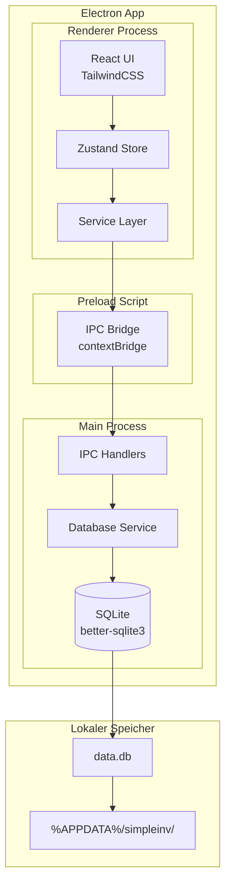

# 2. High-Level Architektur

## 2.1 Technische Zusammenfassung

SimpleInv ist eine **Offline-First Desktop-Anwendung** für Windows, gebaut als Electron-App mit React-Frontend und SQLite-Datenbank. Die Architektur folgt dem klassischen Electron-Pattern mit strikter Prozess-Trennung: Der **Main Process** verwaltet die Datenbank und System-Ressourcen, während der **Renderer Process** die React-UI ausführt. Die Kommunikation erfolgt über typsichere IPC-Kanäle mit Preload-Scripts für Context Isolation.

## 2.2 Plattform und Infrastruktur

| Aspekt | Wahl | Begründung |
|--------|------|------------|
| Runtime | Electron 39+ | Cross-Platform Desktop Framework |
| Datenbank | SQLite (better-sqlite3) | Synchron, schnell, Offline-First |
| Speicherort | %APPDATA%/simpleinv/ | Windows-Standard |
| Build/Package | Electron Forge + Vite | Offizielles Tooling |

## 2.3 Repository-Struktur

**Struktur:** Single Repository (kein Monorepo-Tool nötig)

## 2.4 High-Level Architektur-Diagramm



## 2.5 Architektur-Pattern

- **Offline-First Architecture:** Alle Daten lokal in SQLite
- **Process Isolation Pattern:** Strikte Trennung Main/Renderer
- **Repository Pattern:** Abstrahierte Datenbankzugriffe
- **Component-Based UI:** React-Komponenten mit TypeScript
- **Centralized State Management:** Zustand für globalen State

## 2.6 Edge Cases & Grenzszenarien

| Szenario | Verhalten | Technische Umsetzung |
|----------|-----------|---------------------|
| Leere Datenbank | Freundliche "Keine Artikel vorhanden" Nachricht, Metriken zeigen €0,00/0 | Conditional Rendering im Frontend |
| Große Datenmengen (1000+ Artikel) | Tabelle bleibt performant durch virtualisiertes Rendering | TanStack Table mit `@tanstack/react-virtual` bei Bedarf |
| Kategorie mit Artikeln löschen | Artikel behalten, category_id wird NULL | `ON DELETE SET NULL` Foreign Key |
| Ungültige Eingaben | Validierung im Frontend vor Speichern | Zod-Schema oder manuelle Validierung |
| Datenbank-Datei fehlt/korrupt | Automatische Neuerstellung beim Start | try-catch im DatabaseService.initialize() |

## 2.7 Performance-Strategie

**Ziel:** App-Start < 3 Sekunden, UI-Reaktionen < 100ms (NFR1)

| Maßnahme | Beschreibung | Komponente |
|----------|--------------|------------|
| SQLite WAL-Modus | Write-Ahead Logging für schnellere Schreiboperationen | DatabaseService |
| Synchrone DB-Operationen | better-sqlite3 ist synchron → kein Promise-Overhead | Main Process |
| Lazy Loading | Komponenten nur bei Bedarf laden | React.lazy() |
| Vite Code Splitting | Automatisches Chunking für schnelleren Initial Load | Build Config |
| Indexed Queries | Indizes auf `status` und `category_id` für schnelle Filterung | DB Schema |
| Minimale Dependencies | Nur essentielle Libraries, kein Redux/MobX Overhead | package.json |

**Messbare Ziele:**

| Metrik | Zielwert |
|--------|----------|
| Cold Start (erste Öffnung) | < 3s |
| Warm Start (App bereits geladen) | < 1s |
| Artikel laden (100 Artikel) | < 50ms |
| Artikel speichern | < 20ms |

## 2.8 Fehlerbehandlungsstrategie

### Frontend (Renderer Process)

```typescript
// src/renderer/utils/errorHandling.ts

// Alle IPC-Aufrufe werden in try-catch gewrappt
try {
  const articles = await window.api.articles.getAll();
  set({ articles, isLoading: false });
} catch (error) {
  set({ error: parseError(error), isLoading: false });
  // Toast-Notification an User
}
```

### Backend (Main Process)

```typescript
// src/main/ipc/handlers/baseHandler.ts

// IPC Handler Pattern
ipcMain.handle('articles:create', async (_, input: ArticleInput) => {
  try {
    return articleRepository.create(input);
  } catch (error) {
    // Strukturierter Fehler zurück an Renderer
    throw new IpcError('ARTICLE_CREATE_FAILED', error.message);
  }
});
```

### Fehlertypen

| Typ | Beispiel | User-Feedback |
|-----|----------|---------------|
| Validierungsfehler | Titel leer, Preis negativ | Inline-Fehlermeldung im Formular |
| Datenbankfehler | SQLite UNIQUE Constraint | Toast: "Kategorie existiert bereits" |
| Systemfehler | Datenbank nicht erreichbar | Modal: "Datenbank konnte nicht geladen werden" |

### Graceful Degradation

- Bei DB-Fehler: App zeigt Fehlermeldung, blockiert aber nicht komplett
- Bei Theme-Ladefehler: Fallback auf Light Mode
- Bei korrupter Einstellung: Zurücksetzen auf Default-Wert

---
