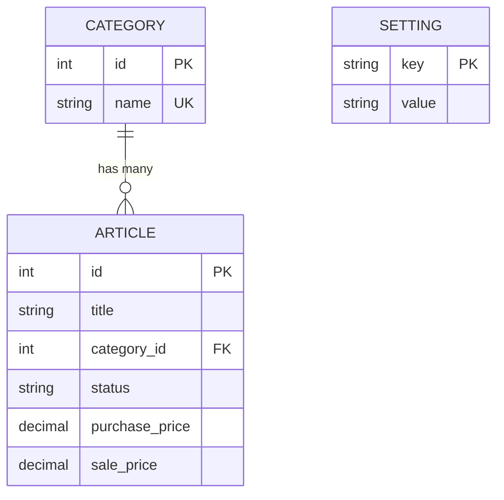

# 4. Datenmodelle

## 4.1 Article (Artikel)

```typescript
// src/shared/types/article.ts

export type ArticleStatus = 'in_stock' | 'listed' | 'sold' | 'returned';

export interface Article {
  id: number;
  title: string;
  categoryId: number | null;
  status: ArticleStatus;
  purchasePlatform: string | null;
  purchasePrice: number;
  purchaseDate: string | null;
  shippingCostIn: number;
  salePlatform: string | null;
  salePrice: number | null;
  saleDate: string | null;
  fees: number;
  shippingCostOut: number;
  createdAt: string;
  updatedAt: string;
}

export interface ArticleInput {
  title: string;
  categoryId: number | null;
  status: ArticleStatus;
  purchasePlatform?: string;
  purchasePrice: number;
  purchaseDate?: string;
  shippingCostIn?: number;
  salePlatform?: string;
  salePrice?: number;
  saleDate?: string;
  fees?: number;
  shippingCostOut?: number;
}

export interface ArticleWithCalculations extends Article {
  profit: number | null;
  roi: number | null;
}
```

## 4.2 Category (Kategorie)

```typescript
// src/shared/types/category.ts

export interface Category {
  id: number;
  name: string;
}

export interface CategoryInput {
  name: string;
}
```

## 4.3 Setting (Einstellung)

```typescript
// src/shared/types/settings.ts

export type ThemeMode = 'light' | 'dark' | 'custom';

export interface ThemeSettings {
  mode: ThemeMode;
  customColor?: string;
}

export interface AppSettings {
  theme: ThemeSettings;
}

export const SETTING_KEYS = {
  THEME: 'theme',
} as const;
```

## 4.4 Berechnungs-Utilities

```typescript
// src/shared/utils/calculations.ts

export function calculateProfit(article: Article): number | null {
  if (article.salePrice === null) return null;
  return (
    article.salePrice -
    article.purchasePrice -
    article.fees -
    article.shippingCostIn -
    article.shippingCostOut
  );
}

export function calculateRoi(article: Article): number | null {
  const profit = calculateProfit(article);
  if (profit === null || article.purchasePrice === 0) return null;
  return Math.round((profit / article.purchasePrice) * 10000) / 100;
}

export function withCalculations(article: Article): ArticleWithCalculations {
  return {
    ...article,
    profit: calculateProfit(article),
    roi: calculateRoi(article),
  };
}
```

## 4.5 Entity-Relationship Diagramm



---
